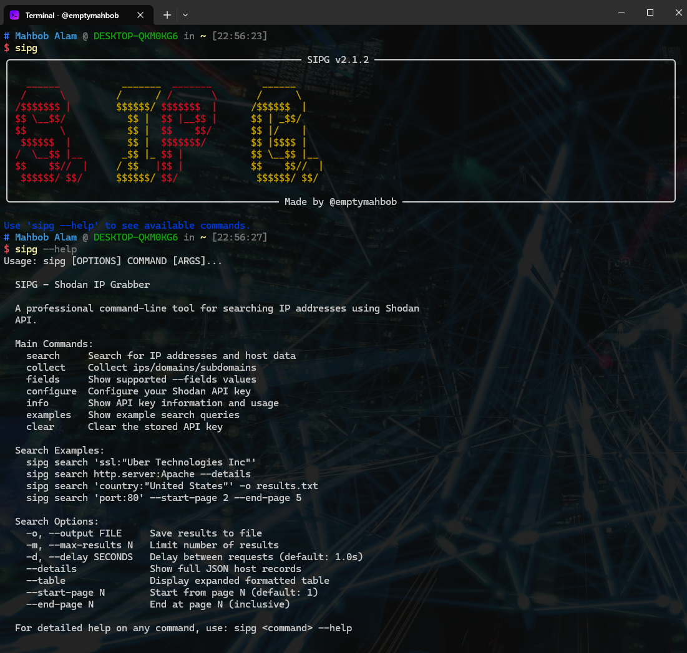

## Shodan IP Grabber (S. IP G.)



## Description

Shodan IP Grabber is a command-line tool that leverages the Shodan API to search for IP addresses based on a specified query. It provides a simple and efficient way to retrieve ips & display them in the command line.

### Installation

1. Clone the repository:

   ```bash
   git clone https://github.com/emptymahbob/shodan-ip-grabber.git

2. Navigate to the project directory:

   ```bash
   cd shodan-ip-grabber

3. Install dependencies:

   ```bash
   pip install -r requirements.txt

## Commands

1. Search for IP addresses and display them in the command line:

    ```bash
     python sipg.py -q "your-search-query"
    
     Common Search Query Examples:

     python sipg.py -q "ssl:\"Uber Technologies Inc\""
  
     python sipg.py -q "ssl:\"Uber Technologies Inc\" http.status:200"
  
     python sipg.py -q "Ssl.cert.subject.CN:\"*.uber.com\""
    

2. Change Shodan API key:

    ```bash
    python sipg.py --change-key
    
3. Remove Shodan API key:

   ```bash
    python sipg.py --remove-key

4. Help:

    ```bash
    python sipg.py --help

## Author

Twitter/X: @emptymahbob 
