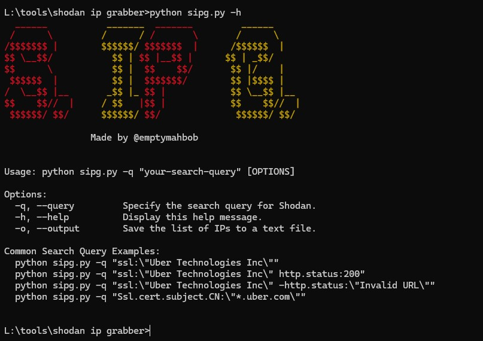

## Shodan IP Grabber (S. IP G.)



## Description

Shodan IP Grabber is a command-line tool that leverages the Shodan API to search for IP addresses based on a specified query. It provides a simple and efficient way to retrieve ips & display them in the command line.

### Installation

1. Clone the repository:

   ```bash
   git clone https://github.com/emptymahbob/sipg.git

2. Navigate to the project directory:

   ```bash
   cd sipg

3. Install dependencies:

   ```bash
   pip install -r requirements.txt

> Note: Must change the apikey from config.json file. Remove the current apikey and put your shodan apikey.

### Commands

1. Search for IP addresses and display them in the command line:

    ```bash
     python sipg.py -q "your-search-query"
    
2. Save results:

    ```bash
    python sipg.py -q "your-search-query" -o output.txt

3. Help:

    ```bash
    python sipg.py -h
    
### Common Search Query Examples:
     python sipg.py -q "ssl:\"Uber Technologies Inc\""
     python sipg.py -q "ssl:\"Uber Technologies Inc\" http.status:200"
     python sipg.py -q "Ssl.cert.subject.CN:\"*.uber.com\""
     python sipg.py -q "ssl:\"Uber Technologies Inc\" -http.title:\"INVALID URL\""

## Author

Twitter/X: https://x.com/emptymahbob
