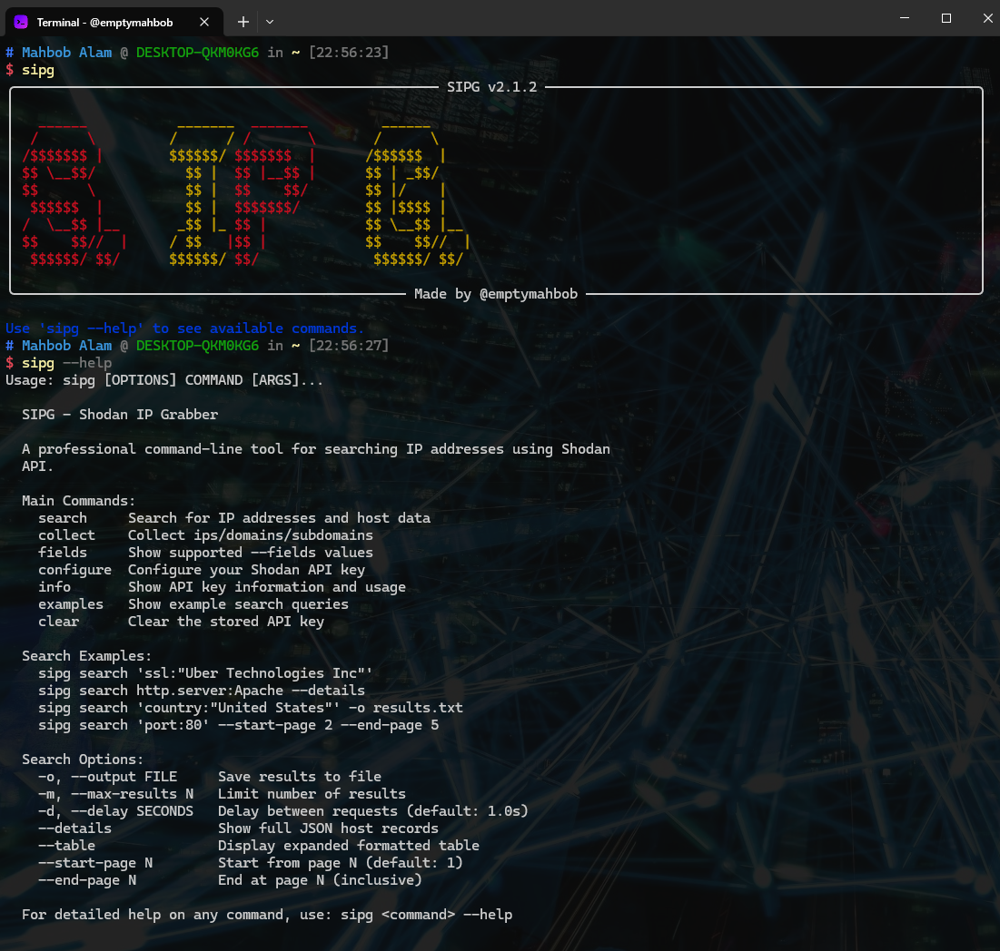

# SIPG — Shodan IP Grabber

[](https://badge.fury.io/py/sipg)
[](https://www.python.org/downloads/)
[](https://opensource.org/licenses/MIT)



<p align="center"><b>Example Search Result</b></p>
<p align="center"></p>

**SIPG** stands for **Shodan IP Grabber**. It is a professional command-line tool for searching internet assets via Shodan. SIPG (Shodan IP Grabber) supports API mode and free mode (no API key), with one primary command: `search`.

## ✨ Features

- 🔍 **Advanced Search**: Powerful query syntax with support for all Shodan search filters
- 📊 **Rich Output**: Beautiful tables and detailed information display
- 💾 **Flexible Export**: Save results to files in various formats
- ⚡ **Rate Limiting**: Built-in API rate limiting to respect Shodan's limits
- 🔐 **Secure Configuration**: Secure API key storage in the user's home directory
- 🌍 **Cross-Platform**: Works on Windows, macOS, and Linux
- 📈 **Progress Tracking**: Real-time progress indicators for long searches
- 🎯 **Multiple Output Formats**: Simple IP lists, detailed results, or formatted tables
- 🆓 **No-Key Search Mode**: Facet-based collection without API key (`--mode free`; default is **`auto`**: REST Search when a key is saved, otherwise free)
- 🧩 **Asset Collection**: Use `search --collect` (default `ips`) with support for comma-separated values like `domains,subdomains`
- 🧠 **Beginner Filter Mode**: Build full Shodan queries with `--filter`

## 🚀 Quick Start

### Installation

#### From PyPI (Recommended)
```bash
pip install sipg
```

#### From Source
```bash
git clone https://github.com/emptymahbob/sipg.git
cd sipg
pip install -e .
```

### Configuration

1. Get your Shodan API key from [shodan.io](https://account.shodan.io/)
2. Configure SIPG (Shodan IP Grabber) with your API key:
```bash
sipg configure
```

### Basic Usage

```bash
# Search for IPs with SSL certificates from Uber
sipg search 'ssl:"Uber Technologies Inc"'

# Search with detailed information
sipg search 'http.server:Apache' --details

# Display results in a table format
sipg search 'port:80' --table

# Save results to a file
sipg search 'country:"United States"' -o results.txt

# Limit results and add delay
sipg search 'product:"nginx"' -m 50 -d 2.0

# Get results from pages 2 to 5 (i.e., results 101-500)
sipg search 'http.server:Apache' --details --start-page 2 --end-page 5

# Save results from pages 5 to 10 to a file
sipg search 'country:"United States"' -o us.txt --start-page 5 --end-page 10

# No-key mode (facet-based)
sipg search 'ssl:"nvidia"' --mode free --silent

# Beginner filter mode
echo "nvidia.com" | sipg search --filter ssl --silent

# Collect domains and subdomains too
sipg search 'ssl:"nvidia"' --mode free --collect all -o assets.txt
```

## 📖 Commands and Arguments

### `sipg configure`
Configure your Shodan API key securely.

**Arguments:**
- `-k, --api-key TEXT`: API key value (prompted securely if omitted).

### `sipg search <query>`
Search and collect assets with one command.

**Options:**
- `-o, --output FILE`: Save results to file. If not specified, results are printed to the console.
- `-m, --max-results N`: Maximum number of results to return. Default: all available results.
- `-d, --delay SECONDS`: Delay (in seconds) between API requests to avoid rate limits.
- `-I, --api-min-interval SECONDS`: Minimum spacing between `api.shodan.io` calls (0 disables spacing).
- `-D, --details, --detail`: Show detailed results with additional information (organization, location, hostnames, etc).
- `-T, --table, --tables`: Display results in an expanded formatted table (IP, org, ASN, ISP, transport, domains, product, OS, timestamp, vuln count).
- `--start-page N`: Start fetching results from this page (1-based, default: 1).
- `--end-page N`: End fetching results at this page (inclusive). If not set, fetches up to the last available page or the maximum number of results.
- `-M, --mode [auto|api|free]`: **`auto`** (default) uses **api** if an API key is configured, otherwise **free**. Use **`-M free`** to force facet/no-key mode even with a key; **`-M api`** forces REST Search (requires a key).
- `-c, --collect TEXT`: Choose asset type(s) to collect.
  - Single values: `ips`, `domains`, `subdomains`, `all`
  - Comma-separated values: `ips,domains`, `domains,subdomains`, etc.
  - Default: `ips`
- `-f, --filter TEXT`: Wrap input as `filter:"value"` (example: `--filter ssl`).
- `-s, --silent`: Print raw values only.
- `-O, --output-format [txt|json|csv]`: Optional override for `--output` format. If omitted, SIPG (Shodan IP Grabber) auto-detects from file extension (`.json`, `.csv`, otherwise `.txt`).
- `-F, --fields`: Comma-separated fields for table/csv schemas. Use `port` for search-hit ports per host; `ports` for full host ports via `GET /shodan/host/{ip}` (example: `ip,port,org,asn`).
- `--domain-suffix TEXT`: For domain/subdomain collection and `hostnames`/`domains` columns, keep only names ending at a label boundary with this suffix (comma-separated for OR). Example: `--domain-suffix mil` keeps `*.mil`, not `*.mil.ng`.

**Quick flag map (common confusion):**
- `-d` = delay seconds (float), example: `-d 1.0`
- `-D` = details mode (API detail view)
- `-T` = table mode (API detail view)
- `-F` = fields list (comma-separated), example: `-F ip,port,org`
- `-f` = filter wrapper, example: `-f ssl`
- `-c` = collect type(s), example: `-c domains,subdomains`
- `--domain-suffix` = suffix filter for domains/subdomains (example: `--domain-suffix mil`)

**How `search` behaves:**
- No `-o`: values are printed to console.
- With `-o`: values are exported to file. Format auto-detects from extension (`.json`, `.csv`, otherwise `.txt`).
- Use `-O` only when you want to override extension-based detection.
- `--details` and `--table` are API-oriented views for rich host records.
- In free mode, `--collect ips` streams IP results progressively.
- If you use free mode or `--collect` without IPs, the tool ignores `--details/--table` and shows a warning.

**Common mistakes and fixes:**
- `Option '-d' requires an argument`:
  - use `-d <float>`, e.g. `-d 1.0`
- `Invalid value for '-d' / '--delay'`:
  - you likely passed fields to `-d`; use `-F` for fields
- `--details` / `--table` with **`-M free`** and `-c ips`:
  - free mode only streams plain IPs; **with default `-M auto` and a saved key**, searches use the REST API, and `-D` / `-T` use host/search when your key allows it
  - without a key, you only get the IP list; add a key (`sipg cfg`) or pass `-M api` explicitly
- `Error: Got unexpected extra argument` after `-D` or `-T`:
  - `-D` and `-T` are flags (on/off). They take **no** value. For columns use `-F ip,hostnames,...` with `-M api -D` or `-T`
- `-D` / `-T` / `-F` still show **only plain IPs**:
  - you may be in **free** mode (`-M free`) or your key may be denied **host/search** (see `sipg info --probe` and the 403 note below). With a key and Search access, SIPG uses the API for rich output. **Upgrade/reinstall** if behavior seems outdated: `pip install -U sipg` or `pip install -e /path/to/sipg`
- **`sipg info` works but `-D`/`-T` returns HTTP 403**:
  - **api-info** and **host/search** are different endpoints; some plans/keys allow one but not the other. SIPG falls back to **free IP streaming** when host/search is denied. For full JSON/table, upgrade your Shodan plan or use a key with Search API access.
- **Academic membership API key**:
  - Academic keys are a separate Shodan program; your plan line in `sipg info` may still look generic (e.g. `dev`) while permissions are set by Shodan. **Search** (`/shodan/host/search`) can return **403** even when **api-info** succeeds, depending on how your Academic access is configured. Check [account.shodan.io](https://account.shodan.io/) (API access / documentation for your tier) or contact Shodan if Search should be included. SIPG’s **403 fallback** (plain IPs via free mode) still works the same.

### `sipg fields`
Show all supported field names for `search --fields` and asset CSV export.

```bash
sipg fields

# Machine-readable output for scripts
sipg fields -j
```

### Short aliases

SIPG (Shodan IP Grabber) includes short command aliases for faster usage:

```bash
s   # search
cfg # configure
i   # info
ex  # examples
cl  # clear
fs  # fields
```

**How output is saved:**
- By default, results are printed to the console.
- Use `-o/--output` to save results to a file.
- Export format is auto-detected from extension:
  - `.json` -> JSON
  - `.csv` -> CSV
  - anything else -> TXT
- Use `-O/--output-format` only if you want to override extension-based format detection.
- Saved content follows your `--collect` selection:
  - Default (`--collect` omitted): `ips`
  - Examples: `-c domains`, `-c domains,subdomains`, `-c all`
- In API detailed mode (`--details` / `--table`), exports include rich host fields; use `-F/--fields` to customize CSV/table schemas.
- `-F ... port` shows ports from search matches (merged per IP); `-F ... ports` loads full host port lists via `GET /shodan/host/{ip}`.
- Use `--domain-suffix` to keep only names ending with specific suffixes (for collection and `hostnames`/`domains` table/CSV fields).
- Use `--max-results` to limit the number of results.
- Use `--start-page` and `--end-page` to fetch results from a specific page range (each page = 100 results).
- Use `--delay` to avoid hitting Shodan rate limits (default: 1.0s).

**Examples:**
```bash
# Default behavior (no --collect): IPs only
sipg search 'ssl:"nvidia"'

# Collect domains and subdomains together
sipg search 'ssl:"nvidia"' -c domains,subdomains --mode free

# Save combined assets to CSV
sipg search 'ssl:"nvidia"' -c ips,domains,subdomains -o assets.csv --fields type,value

# Save domains only to JSON (auto-detected from extension)
sipg search 'ssl:"nvidia"' -c domains -o domains.json

# Delay must be a float
sipg search 'ssl:"nvidia"' -c domains,subdomains -d 1.0

# Fields use -F (not -d)
sipg search 'port:443' -M api -T -F ip,hostnames,org,location,port

# Full host ports for each IP (extra host lookups)
sipg search 'port:443' -M api -T -F ip,hostnames,org,ports

# Keep only names ending in .mil (not .mil.ng)
sipg search 'ssl:"nextcloud"' -c domains,subdomains --domain-suffix mil

# Get the first 200 results
sipg search 'ssl:"Uber Technologies Inc"' --max-results 200

# Get results from pages 2 to 5 (i.e., results 101-500)
sipg search 'http.server:Apache' --details --start-page 2 --end-page 5

# Save results from pages 5 to 10 to a file
sipg search 'country:"United States"' -o us.txt --start-page 5 --end-page 10
```

### `sipg info`
Show information about your Shodan API key and usage (calls **`GET /api-info`** — plan and credits, not per-endpoint permissions).

**How to know what your key allows**

- **`sipg info`** reflects **account/plan** data from Shodan, not a full ACL list for every endpoint.
- **`sipg info --probe`** runs one minimal **`GET /shodan/host/search`** (uses **1 query credit**) and reports whether Search API access works for rich flags (`-D` / `-T` / `-F`). If this fails with **403** while `api-info` succeeds, your plan/key may block Search while still showing credits — see [Shodan Developer API](https://developer.shodan.io/api) and your account settings.

### `sipg examples`
Display example search queries.

### `sipg clear`
Clear the stored API key.

### Command aliases
- `sipg s` → `sipg search`
- `sipg cfg` → `sipg configure`
- `sipg i` → `sipg info`
- `sipg ex` → `sipg examples`
- `sipg cl` → `sipg clear`
- `sipg fs` → `sipg fields`

## 🔍 Search Query Examples

```bash
# SSL certificates
sipg search 'ssl:"Uber Technologies Inc"'
sipg search 'ssl.cert.subject.CN:"*.uber.com"'

# HTTP servers
sipg search 'http.server:Apache'
sipg search 'http.status:200'

# Geographic location
sipg search 'country:"United States"'
sipg search 'city:"New York"'

# Port scanning
sipg search 'port:80'
sipg search 'port:443'

# Products and services
sipg search 'product:"nginx"'
sipg search 'product:"MySQL"'

# Organizations
sipg search 'org:"Amazon"'
sipg search 'org:"Google"'

# Complex queries
sipg search 'ssl:"Uber Technologies Inc" http.status:200'
sipg search 'port:80 -http.title:"Invalid URL"'
```

## Shodan REST API (official reference)

Official base URL for REST methods: **`https://api.shodan.io`**

Full method list and parameters: [Shodan Developer API](https://developer.shodan.io/api) (Search, On-Demand Scanning, Alerts, DNS, etc.).

**How SIPG uses it**

| Shodan method | SIPG usage |
|---------------|------------|
| `GET /api-info` | `sipg info` — plan, credits, query credits |
| `GET /shodan/host/search` | `sipg search` with **`-D` / `-T` / `-F`** (full host JSON, table, column export); **`sipg info --probe`** for a one-call access check (1 query credit) |
| *(no REST equivalent for “all facet values”)* | **`--mode free`** — HTML facet pages on `www.shodan.io`, not the REST Search API |

Non-`200` responses include an `error` message in JSON (see Shodan docs). **`403`** on `host/search` while **`api-info`** works usually means your key/plan does not allow that Search endpoint — not a SIPG bug.

## 🛠️ Development

### Setup Development Environment
```bash
git clone https://github.com/emptymahbob/sipg.git
cd sipg
pip install -e ".[dev]"
```

### Run Tests
```bash
pytest
```

### Code Formatting
```bash
black sipg/
```

### Type Checking
```bash
mypy sipg/
```

## 📄 License

This project is licensed under the MIT License - see the [LICENSE](LICENSE) file for details.

## 🤝 Contributing

Contributions are welcome! Please feel free to submit a Pull Request.

## 📞 Support

- **Author**: Mahbob Alam (@emptymahbob)
- **Email**: emptymahbob@gmail.com
- **Twitter**: https://x.com/emptymahbob
- **Issues**: https://github.com/emptymahbob/sipg/issues

## ⚠️ Disclaimer

This tool is for educational and authorized security research purposes only. Always ensure you have proper authorization before scanning any networks or systems. The authors are not responsible for any misuse of this tool.
