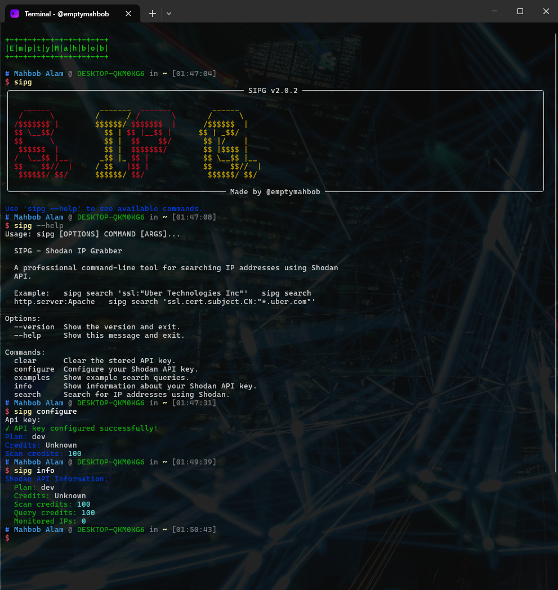

# SIPG - Shodan IP Grabber

[](https://badge.fury.io/py/sipg)
[](https://www.python.org/downloads/)
[](https://opensource.org/licenses/MIT)



<p align="center"><b>Example Search Result</b></p>
<p align="center"></p>

A professional command-line tool for searching IP addresses using the Shodan API. SIPG provides an intuitive interface for security researchers, penetration testers, and network administrators to discover and analyze internet-connected devices.

## ✨ Features

- 🔍 **Advanced Search**: Powerful query syntax with support for all Shodan search filters
- 📊 **Rich Output**: Beautiful tables and detailed information display
- 💾 **Flexible Export**: Save results to files in various formats
- ⚡ **Rate Limiting**: Built-in API rate limiting to respect Shodan's limits
- 🔐 **Secure Configuration**: Secure API key storage in user's home directory
- 🌍 **Cross-Platform**: Works on Windows, macOS, and Linux
- 📈 **Progress Tracking**: Real-time progress indicators for long searches
- 🎯 **Multiple Output Formats**: Simple IP lists, detailed results, or formatted tables

## 🚀 Quick Start

### Installation

#### From PyPI (Recommended)
```bash
pip install sipg
```

#### From Source
```bash
git clone https://github.com/emptymahbob/sipg.git
cd sipg
pip install -e .
```

### Configuration

1. Get your Shodan API key from [shodan.io](https://account.shodan.io/)
2. Configure SIPG with your API key:
```bash
sipg configure
```

### Basic Usage

```bash
# Search for IPs with SSL certificates from Uber
sipg search 'ssl:"Uber Technologies Inc"'

# Search with detailed information
sipg search 'http.server:Apache' --details

# Display results in a table format
sipg search 'port:80' --table

# Save results to a file
sipg search 'country:"United States"' -o results.txt

# Limit results and add delay
sipg search 'product:"nginx"' -m 50 -d 2.0

# Get results from pages 2 to 5 (i.e., results 101-500)
sipg search 'http.server:Apache' --details --start-page 2 --end-page 5

# Save results from pages 5 to 10 to a file
sipg search 'country:"United States"' -o us.txt --start-page 5 --end-page 10
```

## 📖 Commands

### `sipg configure`
Configure your Shodan API key securely.

### `sipg search <query>`
Search for IP addresses using Shodan.

**Options:**
- `-o, --output FILE`: Save results to file. If not specified, results are printed to the console. Only IPs are saved for simple output, or detailed JSON for --details.
- `-m, --max-results N`: Maximum number of results to return. Default: all available results.
- `-d, --delay SECONDS`: Delay (in seconds) between API requests to avoid rate limits.
- `--details`: Show detailed results with additional information (organization, location, hostnames, etc).
- `--table`: Display results in a formatted table (implies --details).
- `--start-page N`: Start fetching results from this page (1-based, default: 1).
- `--end-page N`: End fetching results at this page (inclusive). If not set, fetches up to the last available page or max-results.

**How output is saved:**
- By default, results are printed to the console.
- Use `-o/--output` to save results to a file. If `--details` is used, detailed JSON is saved; otherwise, only IPs are saved.
- Use `--max-results` to limit the number of results.
- Use `--start-page` and `--end-page` to fetch results from a specific page range (each page = 100 results).
- Use `--delay` to avoid hitting Shodan rate limits (default: 1.0s).

**Examples:**
```bash
# Get the first 200 results
sipg search 'ssl:"Uber Technologies Inc"' --max-results 200

# Get results from pages 2 to 5 (i.e., results 101-500)
sipg search 'http.server:Apache' --details --start-page 2 --end-page 5

# Save results from pages 5 to 10 to a file
sipg search 'country:"United States"' -o us.txt --start-page 5 --end-page 10
```

### `sipg info`
Show information about your Shodan API key and usage.

### `sipg examples`
Display example search queries.

### `sipg clear`
Clear the stored API key.

## 🔍 Search Query Examples

```bash
# SSL certificates
sipg search 'ssl:"Uber Technologies Inc"'
sipg search 'ssl.cert.subject.CN:"*.uber.com"'

# HTTP servers
sipg search 'http.server:Apache'
sipg search 'http.status:200'

# Geographic location
sipg search 'country:"United States"'
sipg search 'city:"New York"'

# Port scanning
sipg search 'port:80'
sipg search 'port:443'

# Products and services
sipg search 'product:"nginx"'
sipg search 'product:"MySQL"'

# Organizations
sipg search 'org:"Amazon"'
sipg search 'org:"Google"'

# Complex queries
sipg search 'ssl:"Uber Technologies Inc" http.status:200'
sipg search 'port:80 -http.title:"Invalid URL"'
```

## 🛠️ Development

### Setup Development Environment
```bash
git clone https://github.com/emptymahbob/sipg.git
cd sipg
pip install -e ".[dev]"
```

### Run Tests
```bash
pytest
```

### Code Formatting
```bash
black sipg/
```

### Type Checking
```bash
mypy sipg/
```

## 📄 License

This project is licensed under the MIT License - see the [LICENSE](LICENSE) file for details.

## 🤝 Contributing

Contributions are welcome! Please feel free to submit a Pull Request.

## 📞 Support

- **Author**: Mahbob Alam (@emptymahbob)
- **Email**: emptymahbob@gmail.com
- **Twitter**: https://x.com/emptymahbob
- **Issues**: https://github.com/emptymahbob/sipg/issues

## ⚠️ Disclaimer

This tool is for educational and authorized security research purposes only. Always ensure you have proper authorization before scanning any networks or systems. The authors are not responsible for any misuse of this tool.
